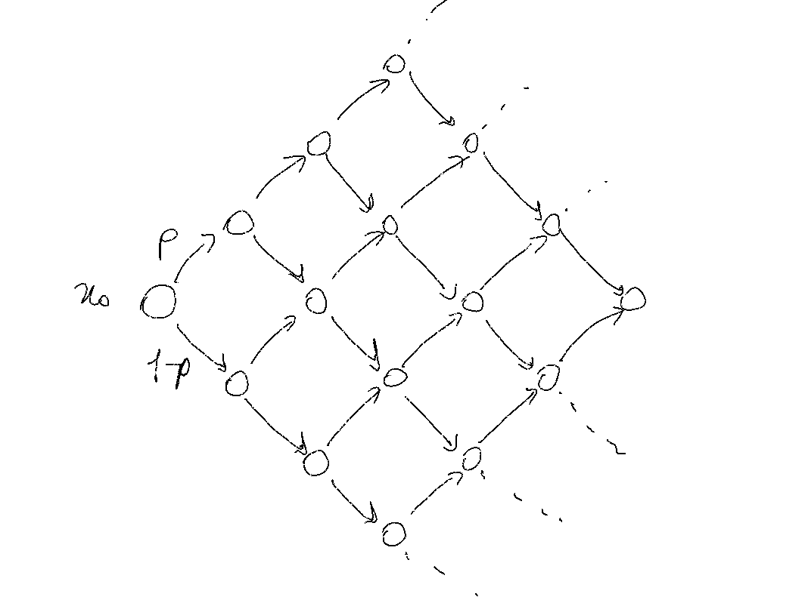

```{r load-pkgs, echo=TRUE, include=FALSE}
# Clear workspace
rm(list = ls())
# Load libraries
library(IRdisplay)
library(igraph)
igraph_options(vertex.frame.color = "white", vertex.frame.size = 1)
library(tidyverse)
theme_set(new = theme_light())
mygreen <- hcl(h = c(135), c = 70, l = 80)
options(repr.plot.width = 4*1.5, repr.plot.height = 3*1.5)
```

# >Who are we (CoMuNe Lab)?

[comunelab.fbk.eu](http://comunelab.fbk.eu/)

[twitter](https://twitter.com/ComuneLab)

# Networks: A very brief Introduction

A seminar series on Networks for the Masters in Math and Data Science.

Practical Issues:

* R needed
* I am using Jupyter Notebooks (read [this, on _Nature_](https://www.nature.com/articles/d41586-018-07196-1) to see how **cool** Jupyter is!!):

    * http://jupyter.org/install
    * https://irkernel.github.io/installation/
    * just as Rmarkdown (code not in chunks but in code-cells and markdown in markdown-cells)
    * [Binder](https://mybinder.org/)

## Contents

0. Why do we study Networks?

  * Complex Systems
  * Network Modeling


1. Fundamentals of Graph Theory
  * Definitions
  * The Laplacian of a Graph
  * Random Walks and Graphs

2.  Network Centrality
3. Community Detection
4. _Current Research at CoMuNe Lab - FBK_

## References

Ognyanova, K. (2016) *Networks analysis with R and igraph: NetSci X Tutorial.* Retrieved from [www.kateto.net/networks-r-igraph](http://kateto.net/networks-r-igraph).

Newman, M. (2018). *Networks*. Oxford university press.

Masuda, N., Porter, M. A., & Lambiotte, R. (2017). Random walks and diffusion on networks. [Physics reports.](https://doi.org/10.1016/j.physrep.2017.07.007)

## 0. Why do we study Networks?

Networks are a natural framework for representing and studying systems of ineracting unitns.

### Complex Systems

[Top 20 Papers That Will Introduce You to Complexity Theory Research
](http://complexitylabs.io/top-20-papers-that-will-introduce-you-to-complexity-theory-research/)

**Focus shift**: from the analysis of small graphs (with tens of vertices) and individual nodes/edges features to the study of very large systems (millions of entities) and their large-scale statistical properties.

##### Some Keywords:

* interacting parts
* emergence
* collective behaviour
* self-organisation
* evolution
* patterns
* non-linearity
* ...

##### Some examples

* Ecosystems
* Human body or brain...
* An [ant colony](https://www.quantamagazine.org/ants-build-complex-structures-with-a-few-simple-rules-20140409/)
* ...
* Millennium Bridge, London, 2000

<iframe width="560" height="315"
    src="https://www.youtube.com/embed/eAXVa__XWZ8"
    frameborder="0" allow="accelerometer; autoplay; encrypted-media; gyroscope;
    picture-in-picture" allowfullscreen></iframe>

### Network Modeling

Networks as mathematical models of complex systems, [Borgatti, Halgin 2011](http://steveborgatti.com/papers/orsc.1110.0641.pdf).

> A graph $G = (V, E)$ is a pair of sets, where the elements of $V$ are called _vertices_ (nodes), $E \subseteq V \times V$.
>
> For $u, v \in V$, $(u, v) \in E$, or $\{u, v\} \in E$ if $G$ is undirected, are called _edges_.

Elements ~ **vertices**, interactions and relationships ~ **edges**.

The pattern of connections in a network yields a particular network structure so we can study its characteristics (e.g. edge denity, rich-clubs, **community structure** etc.) and what position vertices occupy (node **centrality**).


#### Importance of Network Modeling

* Framework with applications in various fiedls
* Model: simplify and find key feature of the problem

## 1. Fundamentals of Graph Theory

Throughout this course we are going to mix theory and practice, so to have a rough idea of network analysis in R.

R packages required:

* `igraph`, see [`igraph`'s documentation](http://igraph.org/r/doc/);
* `igraphdata`

### 1.1 Definitions

###### Def. (Graph)
A graph $G = (V, E)$ is a pair of sets, where the elements of $V$ are called vertices (nodes), $E \subseteq V \times V$, whit $(u, v) \in E$ (if $G$ is undirected $\{u, v\}$) is an _edge_ for $u, v \in V$.


```{r first-g, echo=TRUE}
g <- make_graph(edges = c("a", "b", "b", "c", "a", "d", "c", "d", "a", "e"), directed = FALSE)
plot(g)
```

Networks do not have to be _connected_. A disconnected network is one in which some nodes cannot reach certain others by any path; the network is divided into _components_. Nodes without any adjacent are said to be _isolated_.


```{r g-plot, echo=TRUE}
g <- make_graph(edges = c("a", "b", "b", "c", "a", "d", "c", "d", "a", "e", "h", "i", "h", "j", "h", "k"),
                isolates = c("f", "g"),
                directed = FALSE)
plot(g)
```

You can explore the graph, asking for the sets $V$, $E$.

```{r g-V-E, echo=TRUE}
V(g)
E(g)
```

And compute $|V|$ and $E$

```{r g-N-m, echo=c(1,3)}
N <- length(V(g))
N
m <- dim(get.edgelist(g))[1]
m
```

### Adjacency list
Given a vertex $u$ we can loo at its _adjacents_ or _adjacency set orlist_
$$
A(u) = \{v \in V(G) : (u, v) \in E\}.
$$
Take "a" in our example:


```{r adjacents-a, echo=TRUE}
adjacent_vertices(g, "a")
```

A graph is completely determined by $V$ and the adjacency sets $A(u)$ for each $u \in V$, in `igraph`:
`as_adj_list(graph, mode = c("all", "out", "in", "total"))`

```{r g-adj_list, echo=TRUE}
as_adj_list(g)
```

## Adjacency Matrix

Take node "a", from its adjacency list we can build the following vector

```{r echo=TRUE}
as.vector(g["a", ])
```

Then take two nodes "a" and "b":

```{r echo=TRUE}
as.matrix(g[c("a", "b"), ])
```
Putting all vectors together, for each node in $G$, we get a very important matrix, which completely determines $G$: the _adjacency matrix_.

#### Def. Adjacency Matrix

> Given a graph $G = (V, E)$ with $N = |V|$ vertices, which can be labeled from $1, \dots, N$.
The adjacency matrix $A$ of $G$ is defined as
$A = \{a_{ij}\}_{i,j=1}^{N}$, where its elements are
$$a_{ij} =
\begin{cases}
1 & (i, j) \in V \\
0 & \text{otherwise}
\end{cases}$$

In `igraph`:

```{r echo=TRUE, eval=FALSE}
as_adjacency_matrix(graph, type = c("both", "upper", "lower"), attr = NULL,
                    edges = FALSE, names = TRUE, sparse = igraph_opt("sparsematrices"))
```


```{r adj-matrix, echo=TRUE}
g[] # equivalently: as_adjacency_matrix(g)
```
**Observation:** The adjacency matrix of $G$ is a block matrix, $G$ is not connected.

Graphs are also very stuidied as a data structure:

* graphs and trees (an undirected graph $G$ is a tree if for each $u, v \in G$ there exists a unique path connecting $u$ and $v$;
* representations of graphs: adjacency sets and lists, matrices
* search algorithms on graphs
* ...

We will now see several ways to save an igraph-graph and the other way around

`write_graph(graph, file, format = c("edgelist", ...), ...)`

`read_graph(file, format = c("edgelist", ...), ...)`

```{r write-el, echo=TRUE}
as_edgelist(g)
write_graph(g, "g-edge-list.txt", format = "edgelist")
# read_graph("g-edge-list.txt", format = "edgelist")
```

```{r write-el-v2, echo=TRUE}
el <- as_edgelist(g)
# write_csv(data.frame(el) , "el.csv", col_names = F)
```

Small networks can also be saved and build from their adjacency matrix

```{r echo=TRUE, eval=FALSE}
graph_from_adjacency_matrix(adjmatrix,
                            mode = c("directed", "undirected", "max", "min", "upper", "lower", "plus"),
                            weighted = NULL, diag = TRUE, add.colnames = NULL, add.rownames = NA)

from_adjacency(...)
```


```{r echo=TRUE}
adj_matrix <- as_adjacency_matrix(g)
plot(graph_from_adjacency_matrix(adj_matrix, mode = "undirected"))
```

In order to write and read the graph using its adjacency matrix, uncomment the code in the next cell. Observe that the sparse matrix is converted to a full matrix `as.matrix(adj_matrix)`, which is usually a problem for larger networks. Alternatively use
```{r echo=TRUE, eval=FALSE}
writeMM(sparse_matrix,file)
readMM(file)
```
to write/read spare matrices to/from text files; for undirected graphs it is also better to save just a triangular adjacency matrix.

**N.B.** Edge lists are preferred!

```{r echo=TRUE, eval=FALSE}
# save adjacency matrix, read it and build (plot) the resulting graph
write.csv(as.matrix(adj_matrix), file = "g-adj-matrix.csv")
plot(graph_from_adjacency_matrix(as.matrix(read.csv("g-adj-matrix.csv", row.names = 1)), mode = "undirected"))
```

## Degree of a node

Given a vertex $v \in V$ we can count how many edges are connected to $v$. If the graph is _simple_, i.e. no loops and no multiedges, then the number of $v$'s incident edges is equal to the length of its adjacency list. This is a key number and it is called the _degree_ of vertex $v$.

#### Def. Degree

> The _degree_ $k_i$ of a vertex $i \in G$ is the number of edges incident to $i$. Given $A$ the adjacency matrix of $G$
$$k_i = \sum_j a_{ij}.$$

#### Def. Degree distribution.

> Given vertex $i \in G$ we can ask what is the probability of its degree being exactly $k$ and this is given by
$$P(k_i = k) = \frac{n_k}{N}$$
where $n_k$ is the number of nodes having degree $k$.

It is then possible to look at frequency distribution, which is called _degree distribution_.


```{r echo=TRUE}
k_g <- degree(g)
k_g
deg_g <- degree_distribution(g)
```

```{r echo=TRUE}
data <- data.frame("k" = 1:length(deg_g), "deg" = deg_g)
ggplot(data, aes(x = k, y = deg)) +
  geom_col(width = .5) +
  labs(x = "k", y = "P(k)")
```

## Weighted Graphs

A graph $G = (V, E)$ can also be _weighted_ if we provide a weight function $w: V \times V \to \mathbb{R}$. Let the nodes of $G$ be labeled $1, \dots, N = |V|$ then we write $w_{ij} = w(i, j)$ and $w_{i, j} = 0$ if $(i, j) \notin E$.

In particular

* if $G$ is undirected the weight function satisfies $w_{ij} = w_{ji}$
* if $G$ is unweighted we can still think of $w$, in which case
$$w_{ij} = \begin{cases} 1 & (i, j) \in E \\ 0 & (i, j) \notin E. \end{cases} $$

An example of weighted undirected graph is the well-known [Zachary's Karate Club Network](https://www.jstor.org/stable/3629752), often use as a toy model for checking new methods and metrics.


```{r echo=TRUE}
library(igraphdata)
data(karate)
```


```{r echo=TRUE}
plot(karate, layout = layout_in_circle, edge.width = E(karate)$weight)
```


By default `karate` nodes are plotted in different colours, reflecting the two factions in this social network. We will see it in detail in the **Community Detection** module.


```{r echo=TRUE}
karate[]
```

**Observations.**

* Nodes are called "actors" in social network analysis and edges are usually referred to as "ties".
* Entries of the adjacency matrix are now weights $a_{ij} = w_{ij}$.
* The [karate club network](https://www.jstor.org/stable/3629752) is undirected, indeed the adjacency matrix is symmetric:


```{r echo=TRUE}
isSymmetric(as.matrix(karate[]))
```

### Degree of a weighted graph
The _degree_ becomes then a weighted degree $$k_i = \sum_j w_{ij}.$$

We can also build the degree matrix $D$, a diagonal $N \times N$ matrix having $d_{ii} = k_i$ on the diagonal.


```{r echo=TRUE}
head(degree(karate))
```

```{r echo=TRUE}
data <- data.frame(deg = degree(karate))
ggplot(data = data, aes(x = deg)) +
  geom_bar(aes(y = (..count..)/sum(..count..))) +
  labs(x = "k", y = "P(k)")
```

### 1.2 The Laplacian of a Graph

A very important matrix in network science is the graph's Laplacian matrix $L$, also called admittance or Kirchhoff matrix, together with its _normalised_ counterpart $\textbf{L}$.
The main reference for the following paragraphs is [Chung, 1997](https://goo.gl/5wh715), a classic book in Spectral graph theory; the first chapther can be found [here](http://www.cs.ucsb.edu/~veronika/MAE/lecturesspectralgraphtheory_chung.pdf).

###### Def. (Graph's Laplacian)

Let $G$ be a weighted undirected graph such that $w$ is not-negative. Then the Laplacian matrix $L$ is a square $N \times N$ matrix defined as
\begin{equation}
    l_{ij} =
    \begin{cases}
    k_i - w_{ii} & \text{if } i = j \\
    - w_{ij} & \text{if } i \neq j \\
    0 & \text{otherwise}
    \end{cases}
\end{equation}
note that $L = D - A$, where $D$ and $A$ are respectively the degree and the adjacency matrices.


```{r echo=TRUE}
Lg <- laplacian_matrix(g, normalized = FALSE)
Lk <- laplacian_matrix(karate, normalized = FALSE, weights = NULL) # if NULL and the graph has an edge attribute called
                                                                   # weight, then it will be used automatically
Lg
Lk[1:10, 1:5]
```

#### *Laplacian as an Operator

$L$ can be seen as an **operator** on the space of functions $f: V \to \mathbb{R}$.
Indeed let $v^i: V \to \mathbb{R}$ such that $v^i(v_j) = 1$ if $i=j$ and zero otherwise. Then $\{v^1, \dots, v^N\}$ forms a basis of the vector space of all functions from $V$ to $\mathbb{R}$ and every other function $g$ can be written as $g = \sum_i g_i v^i$ and it can be thought as a column vector.

The operator $L$ satisfies
\begin{align}
  Lf(v_i) & = (k_i - w_{ii}) f(v) - \sum_j w_{ij} f(v_j)\\
  & = \sum_{j} w_{ij} \left( f(v_i) - f(v_j) \right)
\end{align}

and if $G$ is unweighted previous equation can be rewritten as
\begin{equation}
    Lf(v_i) = C \sum_{j} \left( f(v_i) - f(v_j) \right) a_{ij}
\end{equation}
a diffusion operator with diffusion constant $C$.

Indicating with $\langle f, g \rangle = \sum_i f(v_i)g(v_i)$ the standard scalar product in $\mathbb{R}^N$, we also have
\begin{align}
  \langle f, Lf \rangle & = \sum_{i} f(v_i) \sum_{i, j} w_{ij} \left( f(v_i) - f(v_j) \right) \\
  & = \sum_{i, j} w_{ij} \left( f(v_i)^2 - f(v_i)f(v_j) + f(v_j)^2\right) \\
  & = \sum_{i, j} w_{ij} \left( f(v_i) - f(v_j)\right)^2
\end{align}

Looking at the Laplacian as an operator provides to be very useful in characterising its _spectrum_, i.e. the set of its eigenvalues.

#### Normalised Laplacian

Often with "Laplacian" one refers to the normalised matrix $\textbf{L}$.

##### Def. (Normalised Laplacian)
$\textbf{L}$ is defined as
\begin{equation}
    \textbf{l}_{ij} =
    \begin{cases}
    1 - \frac{w_{ii}}{k_i} & \text{if } i = j \\
    - \frac{w_{ih}}{\sqrt{k_i k_j}} & \text{if } i \neq j \text{ and } e_{ij} \in E \\
    0 & \text{otherwise}
    \end{cases}
\end{equation}
and it can be written as $\textbf{L}=D^{-\frac12} L D^{-\frac12}$, with the convention that $D^{-1}(v, v) = 0$ if $k_v=0$, i.e. $v$ is an isolated node.

Further $\textbf{L}=D^{-\frac12} L D^{-\frac12} = D^{-\frac12} (D - A) D^{-\frac12} = I - D^{-\frac12} A D^{-\frac12}$.

Observe that for a _regular_ graph, that is an undirected graph with each vertex having the same degree $k$, last equation reduces to $I - \frac{1}{k} A$.


```{r laplacian, echo=TRUE}
Lng <- laplacian_matrix(g, normalized = TRUE)
Lnk <- laplacian_matrix(karate, normalized = TRUE)
round(Lng, 3)
round(Lnk[1:10, 1:10], 3)
```

One can also visualise the Laplacian by means of a heatmap (I use `ggplot2`).

**N.B.** You can either load
* two libraries `ggplot2` and `reshape2`
* just `tidyverse`, [see here](https://www.tidyverse.org/)

I suggest you the second option since `reshape2` is out of maintenance. Unfortunately syntax between `reshape2` and `tidyr` varies a bit, see [tidyr](https://tidyr.tidyverse.org/).

Here we can see `tidyverse::gather` with key and value names `Var1` and `Var2`, as the default column names in `reshape2::melt`


```{r lap-plot, echo=TRUE}
melted_Lng <- as_tibble(as.matrix(Lng)) %>%
  mutate(Var1 = factor(row.names(.), levels = row.names(.))) %>%
  gather(key = Var2, value = value, -Var1, na.rm = TRUE, factor_key = TRUE)

ggplot(data = melted_Lng, aes(x = Var1, y = Var2, fill = value)) +
  geom_tile() +
  coord_equal() +
  scale_fill_gradient2(low = scales::muted("blue"), mid = "white", high = scales::muted("red")) +
  labs(x = "", y = "", fill = "")
```

```{r echo=TRUE, eval=FALSE}
# install.packages("reshape2")  # install the package if you do not have it
melted_Lng <- reshape2::melt(as.matrix(Lng))
```


```{r lap-plot-2, echo=TRUE}
melted_Lnk <- as_tibble(as.matrix(Lnk)) %>%
  mutate(Var1 = factor(row.names(.), levels = row.names(.))) %>%
  gather(key = Var2, value = value, -Var1, na.rm = TRUE, factor_key = TRUE)

ggplot(data = melted_Lnk, aes(x = Var1, y = Var2, fill = value)) +
  geom_tile() +
  coord_equal() +
  scale_fill_gradient2(low = scales::muted("blue"), mid = "white", high = scales::muted("red")) +
  theme(axis.text.x = element_text(angle = 90, hjust = 1)) +
  labs(x = "", y = "", fill = "")
```

#### Eigenvalues of the Laplacian

Due to the assumption of the kernel symmetry $w$, the (normalised) Laplacian is real symmetric, so that its eigenvalues are **all real and non-negative**.

Some important results are briefly summarised, for details and proofs see [Spectral Graph Theory, Chung 1977].
As a function $g:V \to \mathbb{R}$ can be seen as a vector, we may consider the Rayleigh quotient

\begin{align}
    \frac{\langle g, \textbf{L}g \rangle}{\langle g, g \rangle} & = \frac{\langle g, D^{-\frac12} L D^{-\frac12} g \rangle}{\langle g, g \rangle} \\
    & = \frac{\langle f, L f \rangle}{\langle D^{\frac12}f, D^{\frac12} f \rangle} \\
    & = \frac{\sum_{i, j} \left( f(v_i) - f(v_j) \right)^2 w_{ij}}{\sum_{j} \left( f(v_j) \right)^2 k_j}
\end{align}

From last equation we see that all eigenvalues are non-negative, indeed the smallest eigenvalue of $\textbf{L}$ is $\lambda_0=0$ with eigenvector (or eigenfunction) $\phi_0 = \frac{\textbf{1}D^{\frac12}}{\sqrt{\sum_i k_i}}$, so that $0 = \lambda_0 \leq \lambda_1 \leq \dots \leq \lambda_{N-1}$.


<div style="color:gray;padding-top:20pt">
<b>On Rayleigh Quotient.</b>

It can be shown that, for a given matrix $M$, the Rayleigh quotient $R(M, x)\frac{x^*Mx}{x^*x}$ reaches its minimum value $\lambda_{\min}$ (the smallest eigenvalue of $M$) when $x = v_{\min }$ (the corresponding eigenvector).

Similarly, $R(M,x)\leq \lambda _{\max }$ and $R(M,v_{\max })=\lambda _{\max }$.
</div>

### 1.3 Random Walks and Graphs

Random walks and graphs are closely related. Let us build a simple random walk: given a startng point `x_start` and the number of steps `n_step`, the random walker can only move up or down with equal probability.


```{r echo=TRUE}
my_random_walk <- function(x_start, n_steps) {
    r_steps <- rbinom(n = n_steps, size = 1, prob = 0.5)
    r_steps <- 1*(r_steps) - 1*(rep(1, n_steps) - r_steps)
    rw <- cbind(x = c(x_start[1]:(x_start[1] + n_steps)), y = cumsum(c(x_start[2], r_steps)))
    return(rw)
}
```


```{r echo=TRUE}
rw <- data.frame(my_random_walk(x_start = c(0, 0), n_steps = 1000))
```


```{r echo=TRUE}
options(repr.plot.width = 9, repr.plot.height = 3)
ggplot(rw, aes(x = x, y = y)) +
  geom_line() +
  labs(x = "", y = "")
options(repr.plot.width = 4*1.5, repr.plot.height = 3*1.5)
```


Figure: At each step a random walker starting from $x_0 = 0$ can move up or down ($\pm 1$) with equal probability.

We use to represent it graphically by means of a state diagram, which looks like



This is called a **lattice random walk**, a one dimensional Markov chain with states $\{0, \pm 1, \pm 2, \dots\}$.
Now let us look at the following graph


```{r echo=TRUE}
lattice_g <- make_lattice(c(4, 4))
lattice_layout <- as.matrix(expand.grid(x = c(1:4), y = c(1:4))) %*% matrix(c(1/sqrt(2), -1/sqrt(2), 1/sqrt(2), 1/sqrt(2)), nrow = 2)
plot(lattice_g, layout = lattice_layout, vertex.label = "")
```

This is called a _lattice graph_ or simply a lattice. So we can think of finite state **Markov chains as graphs** where each node has $k_i$ links (in simple undirected graphs), so that the walker can randomly choose one of the $k_i$ possible directions. Let us formalise it.

Let  $G=(V, E)$ be an undirected unweighted graph with vertices $V = 1, \dots, N$, with adjacency matrix $A$ and degree matrix $D = \text{diag}(k_i)$; start a random walk at one node, which may be fixed or drawn from an initial distribution $p_0: V \to \mathbb{R}$ - since $V$ is finite, the initial distribution can be seen as a row vector $\textbf{p}_0=(p_0(i))_{i \in V}$.

Let $X_t$ be the position of the walker at time $t$ and indicate by $p_t(i) = p(X_t = i)$.
If $X_t = i$ in a single time step the walker can move to one of $i$'s adjacent vertices, with probability $\frac{1}{k_i}$.

The sequence of random positions $\{X_t : t = 1, 2, \dots\}$ is a time-homogeneous Markov chain with transition probability
\begin{equation}
  p_{ij} = \frac{a_{ij}}{k_i}.
\end{equation}
In matrix form
\begin{equation*}
  P = D^{-1}A
\end{equation*}
so that the probability of being in $j$ at time $t+1$ is given by
\begin{align}
  p_{t+1}(j) & = \sum_i \frac{a_{ij}}{k_i} p_t(i) \\
  \textbf{p}_{t+1} & = \textbf{p}_t D^{-1}A = \textbf{p}_t P \\
  \textbf{p}_{t+1} & = \textbf{p}_0 P^{t+1}
\end{align}


Probabilities $\textbf{p}_0, \textbf{p}_1, \dots$ are different in general, but for the case of _stationary distribution_ $\boldsymbol{\pi}$, which satisfies
\begin{equation}
  \boldsymbol{\pi} = \boldsymbol{\pi} P.
\end{equation}

In words: if the initial position $X_0$ of the random walker is random with distribution $\boldsymbol{\pi}$ then after $t$ time steps $X_t$ will have the same probability distribution.

If the random walk is (i) **irreducible**, i.e. for all pairs $i, j \in V$ there exists some $s$ such that $p_{ij}^s = p(X_{t+s} = j | X_t = i) > 0$ then a unique stationary distribution exists.

Further, if it is also (ii) **aperiodic**, i.e. $\text{gcd}\{s : p_{ij}^s > 0 \}=1$, then the random walk is said \textit{ergodic} and the following convergence theorem holds

> **Thmeorem [Thm.1.8.3, Norris]**
For any initial distribution $f$
\begin{equation}
  \lim_{s\to\infty} f P^s = \boldsymbol{\pi}
\end{equation}
provided the chain is aperiodic.


The two conditions for ergodicity in terms of graph $G$ are

* $G$ is connected (i)
* $G$ is non-bipartite (ii).

In terms of eigenvalues of the Laplacian $\textbf{L}$, [Lemma 1.7, Chung 1977]

* $\lambda_1>0$ (i) and
* $\lambda_{N-1}<2$ (ii).

Now, let us write $P = D^{-1}A = D^{-\frac12}D^{-\frac12}AD^{-\frac12}D^{\frac12} = D^{-\frac12} (I - \textbf{L}) D^{\frac12}$, where $\textbf{L}$ is the **normalised Laplacian**.

It follows that, in a random walk with an associated connected graph, the transition matrix satisfies $\textbf{1} D P=\textbf{1} DD^{-1}A=D$, therefore the stationary distribution
\begin{equation}
\boldsymbol{\pi} = \frac{1}{\sum_i k_i}D.
\end{equation}

**N.B.** Everything can be generalised to weighted connected networks.

A random walk such that $\pi(i)p_{ij}=\pi(j)p_{ji}$ is called _reversible_.
The associated weighted connected network $G$ has weights satisfying
\begin{equation}
w(i, j) = w(j, i) = \pi(i) p_{ij} \frac{1}{c}
\end{equation}
where $c$ is a constant that can be chosen in order to simplify calculations.
Transition probabilities are $p_{ij} = \frac{w(i, j)}{k_i}$ with $k_i$, weighted degree of $i$.

### Further References on Random Walks and Related Articles.

[Masuda, N., Porter, M. A., & Lambiotte, R. (2017). Random walks and diffusion on networks. Physics reports, 716, 1-58.](https://journals.aps.org/prx/abstract/10.1103/PhysRevX.3.041022)

[Noh, J. D., & Rieger, H. (2004). Random walks on complex networks. Physical review letters, 92(11), 118701.](https://journals.aps.org/prl/abstract/10.1103/PhysRevLett.92.118701).

[De Domenico, M. (2017). Diffusion geometry unravels the emergence of functional clusters in collective phenomena. Physical review letters, 118(16), 168301.](https://journals.aps.org/prl/abstract/10.1103/PhysRevLett.118.168301).
